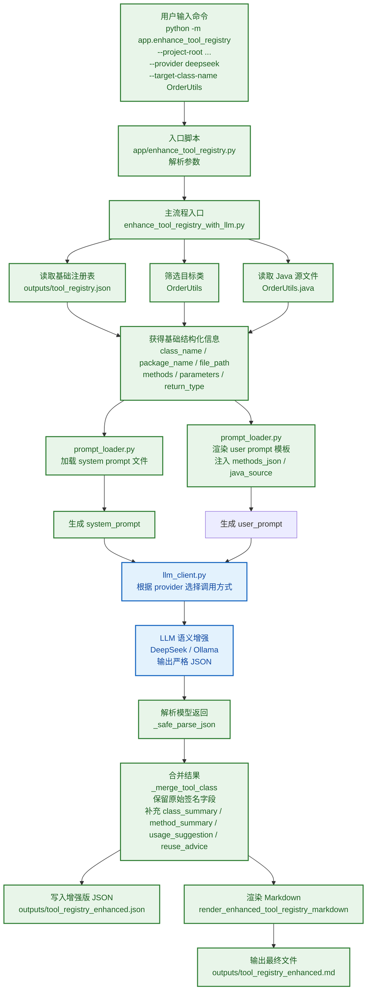

### 颜色说明
- 绿色：本地程序处理，包括参数解析、状态文件读取、Prompt 组装、JSON 合并、Markdown 渲染
- 蓝色：LLM 相关处理，包括 provider 选择、模型调用、语义增强输出

```mermaid
flowchart TD
    A["用户输入命令<br/>python -m app.enhance_tool_registry<br/>--project-root ...<br/>--provider deepseek<br/>--target-class-name OrderUtils"] --> B["入口脚本<br/>app/enhance_tool_registry.py<br/>解析参数"]

    B --> C["主流程入口<br/>enhance_tool_registry_with_llm.py"]

    C --> D["读取基础注册表<br/>outputs/tool_registry.json"]
    C --> E["筛选目标类<br/>OrderUtils"]
    C --> F["读取 Java 源文件<br/>OrderUtils.java"]

    D --> G["获得基础结构化信息<br/>class_name / package_name / file_path<br/>methods / parameters / return_type"]
    E --> G
    F --> G

    G --> H["prompt_loader.py<br/>加载 system prompt 文件"]
    G --> I["prompt_loader.py<br/>渲染 user prompt 模板<br/>注入 methods_json / java_source"]

    H --> J["生成 system_prompt"]
    I --> K["生成 user_prompt"]

    J --> L["llm_client.py<br/>根据 provider 选择调用方式"]
    K --> L

    L --> M["LLM 语义增强<br/>DeepSeek / Ollama<br/>输出严格 JSON"]

    M --> N["解析模型返回<br/>_safe_parse_json"]
    N --> O["合并结果<br/>_merge_tool_class<br/>保留原始签名字段<br/>补充 class_summary / method_summary / usage_suggestion / reuse_advice"]

    O --> P["写入增强版 JSON<br/>outputs/tool_registry_enhanced.json"]
    O --> Q["渲染 Markdown<br/>render_enhanced_tool_registry_markdown"]

    Q --> R["输出最终文件<br/>outputs/tool_registry_enhanced.md"]

    classDef local fill:#e8f5e9,stroke:#2e7d32,stroke-width:2px,color:#1b5e20;
    classDef llm fill:#e3f2fd,stroke:#1565c0,stroke-width:2px,color:#0d47a1;

    class A,B,C,D,E,F,G,H,I,J,N,O,P,Q,R local;
    class L,M llm;
```