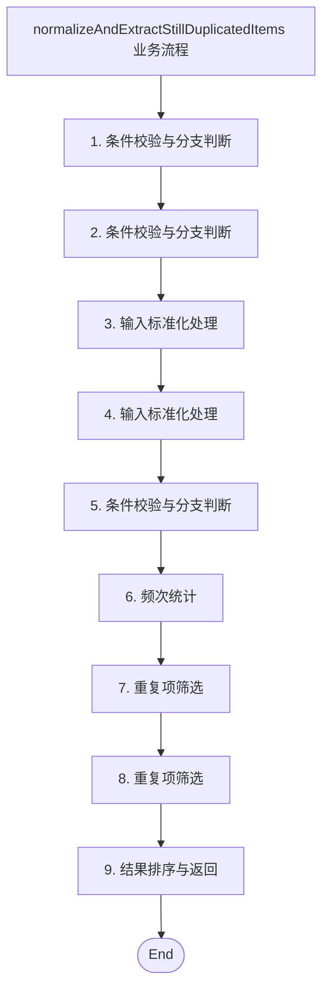
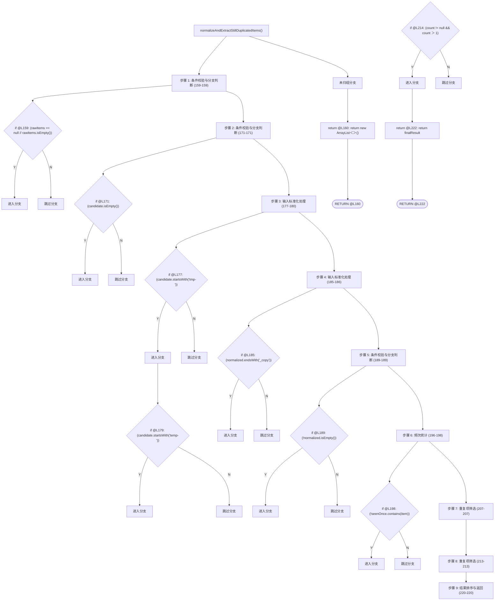

# 方法执行路径说明：normalizeAndExtractStillDuplicatedItems

## 1. 基本信息

- 类名：`OrderUtils`
- 文件：`src/main/java/com/example/ordersystem/util/OrderUtils.java`
- 方法签名：

```java
public static List<String> normalizeAndExtractStillDuplicatedItems(List<String> rawItems)
```

## 2. 最终执行总结

方法 normalizeAndExtractStillDuplicatedItems 的主流程可以概括为：先处理“条件校验与分支判断”，产出是否继续后续流程的判断结论，必要时触发提前返回或分支切换；接着处理“条件校验与分支判断”，产出是否继续后续流程的判断结论，必要时触发提前返回或分支切换；接着处理“输入标准化处理”，得到可继续参与后续处理的规范化结果，异常或无效内容会被清理或跳过；接着处理“输入标准化处理”，得到可继续参与后续处理的规范化结果，异常或无效内容会被清理或跳过；接着处理“条件校验与分支判断”，产出是否继续后续流程的判断结论，必要时触发提前返回或分支切换；接着处理“频次统计”，得到按元素聚合后的频次统计结果，可直接用于后续重复项筛选；接着处理“重复项筛选”，得到只包含真正重复元素的候选结果集合；接着处理“重复项筛选”，得到只包含真正重复元素的候选结果集合；最后处理“结果排序与返回”，得到排序后的最终结果，并完成当前方法的返回。

## 3. 主流程业务步骤

### 步骤 1：条件校验与分支判断

- 代码行范围：`159 - 159`
- 步骤总结：该步骤检查输入或当前候选值是否有效，并决定是提前返回、跳过当前项，还是继续进入后续处理。
- 步骤输入：当前方法参数、已生成的中间变量，以及用于判断是否继续执行的条件状态。
- 步骤输出：产出是否继续后续流程的判断结论，必要时触发提前返回或分支切换。

### 步骤 2：条件校验与分支判断

- 代码行范围：`171 - 171`
- 步骤总结：该步骤检查输入或当前候选值是否有效，并决定是提前返回、跳过当前项，还是继续进入后续处理。
- 步骤输入：当前方法参数、已生成的中间变量，以及用于判断是否继续执行的条件状态。
- 步骤输出：产出是否继续后续流程的判断结论，必要时触发提前返回或分支切换。

### 步骤 3：输入标准化处理

- 代码行范围：`177 - 180`
- 步骤总结：该步骤对原始输入做清洗和规范化处理，例如裁剪前后缀、统一格式，并过滤掉无效内容。
- 步骤输入：原始输入集合或原始字符串，以及当前待清洗的候选值。
- 步骤输出：得到可继续参与后续处理的规范化结果，异常或无效内容会被清理或跳过。

### 步骤 4：输入标准化处理

- 代码行范围：`185 - 186`
- 步骤总结：该步骤对原始输入做清洗和规范化处理，例如裁剪前后缀、统一格式，并过滤掉无效内容。
- 步骤输入：原始输入集合或原始字符串，以及当前待清洗的候选值。
- 步骤输出：得到可继续参与后续处理的规范化结果，异常或无效内容会被清理或跳过。

### 步骤 5：条件校验与分支判断

- 代码行范围：`189 - 189`
- 步骤总结：该步骤检查输入或当前候选值是否有效，并决定是提前返回、跳过当前项，还是继续进入后续处理。
- 步骤输入：当前方法参数、已生成的中间变量，以及用于判断是否继续执行的条件状态。
- 步骤输出：产出是否继续后续流程的判断结论，必要时触发提前返回或分支切换。

### 步骤 6：频次统计

- 代码行范围：`196 - 198`
- 步骤总结：该步骤遍历规范化后的元素并更新 frequencyMap，记录每个候选值的出现次数。
- 步骤输入：已经完成规范化的元素序列，以及用于累计计数的 frequencyMap 中间状态。
- 步骤输出：得到按元素聚合后的频次统计结果，可直接用于后续重复项筛选。

### 步骤 7：重复项筛选

- 代码行范围：`207 - 207`
- 步骤总结：该步骤根据频次统计结果筛选真正重复出现的元素，只保留满足条件的候选项。
- 步骤输入：频次统计结果、候选元素列表，以及当前用于过滤重复项的判定条件。
- 步骤输出：得到只包含真正重复元素的候选结果集合。

### 步骤 8：重复项筛选

- 代码行范围：`213 - 213`
- 步骤总结：该步骤根据频次统计结果筛选真正重复出现的元素，只保留满足条件的候选项。
- 步骤输入：频次统计结果、候选元素列表，以及当前用于过滤重复项的判定条件。
- 步骤输出：得到只包含真正重复元素的候选结果集合。

### 步骤 9：结果排序与返回

- 代码行范围：`220 - 220`
- 步骤总结：该步骤对最终结果进行排序，并输出当前方法的最终返回值。
- 步骤输入：已经筛选完成的结果集合，以及排序规则或比较器。
- 步骤输出：得到排序后的最终结果，并完成当前方法的返回。

## 4. 标准输入模拟

### 标准输入

- `rawItems` (List<String>): `['tmp-a', 'a', 'B_copy', 'b', 'temp-a']`

### 预期执行摘要

- 步骤 1：条件校验与分支判断 → 该步骤检查输入或当前候选值是否有效，并决定是提前返回、跳过当前项，还是继续进入后续处理。
- 步骤 2：条件校验与分支判断 → 该步骤检查输入或当前候选值是否有效，并决定是提前返回、跳过当前项，还是继续进入后续处理。
- 步骤 3：输入标准化处理 → 该步骤对原始输入做清洗和规范化处理，例如裁剪前后缀、统一格式，并过滤掉无效内容。
- 步骤 4：输入标准化处理 → 该步骤对原始输入做清洗和规范化处理，例如裁剪前后缀、统一格式，并过滤掉无效内容。
- 步骤 5：条件校验与分支判断 → 该步骤检查输入或当前候选值是否有效，并决定是提前返回、跳过当前项，还是继续进入后续处理。
- 步骤 6：频次统计 → 该步骤遍历规范化后的元素并更新 frequencyMap，记录每个候选值的出现次数。
- 步骤 7：重复项筛选 → 该步骤根据频次统计结果筛选真正重复出现的元素，只保留满足条件的候选项。
- 步骤 8：重复项筛选 → 该步骤根据频次统计结果筛选真正重复出现的元素，只保留满足条件的候选项。
- 步骤 9：结果排序与返回 → 该步骤对最终结果进行排序，并输出当前方法的最终返回值。

### 预期输出

- `[a, b]（示例：规范化后真正重复出现的元素列表）`

## 5. 调试附录

### 业务流程 Mermaid 图



### 分支执行 Mermaid 图



### 主流程调用明细

- [1] `rawItems.isEmpty()` | type=`library_value_method` | line=`159`
- [2] `candidate.isEmpty()` | type=`library_value_method` | line=`171`
- [3] `candidate.startsWith("tmp-")` | type=`external_instance_method` | line=`177`
- [4] `candidate.substring(4)` | type=`external_instance_method` | line=`178`
- [5] `candidate.startsWith("temp-")` | type=`external_instance_method` | line=`179`
- [6] `candidate.substring(5)` | type=`external_instance_method` | line=`180`
- [7] `normalized.endsWith("_copy")` | type=`external_instance_method` | line=`185`
- [8] `normalized.substring(0, normalized.length() - 5)` | type=`external_instance_method` | line=`186`
- [9] `normalized.length()` | type=`external_instance_method` | line=`186`
- [10] `normalized.isEmpty()` | type=`library_value_method` | line=`189`
- [11] `frequencyMap.put(item, frequencyMap.getOrDefault(item, 0) + 1)` | type=`external_instance_method` | line=`196`
- [12] `frequencyMap.getOrDefault(item, 0)` | type=`external_instance_method` | line=`196`
- [13] `seenOnce.contains(item)` | type=`library_value_method` | line=`198`
- [14] `uniqueProjection.removeIf(item -> frequencyMap.getOrDefault(item, 0) <= 0)` | type=`external_instance_method` | line=`207`
- [15] `frequencyMap.getOrDefault(item, 0)` | type=`external_instance_method` | line=`207`
- [16] `frequencyMap.get(item)` | type=`external_instance_method` | line=`213`
- [17] `finalResult.sort(Comparator.naturalOrder())` | type=`external_instance_method` | line=`220`
- [18] `Comparator.naturalOrder()` | type=`external_static_method` | line=`220`

### 分支信息

- [1] `if` | line=`159` | (rawItems == null || rawItems.isEmpty())
- [2] `return` | line=`160` | return new ArrayList<>();
- [3] `if` | line=`171` | (candidate.isEmpty())
- [4] `if` | line=`177` | (candidate.startsWith("tmp-"))
- [5] `if` | line=`179` | (candidate.startsWith("temp-"))
- [6] `if` | line=`185` | (normalized.endsWith("_copy"))
- [7] `if` | line=`189` | (!normalized.isEmpty())
- [8] `if` | line=`198` | (!seenOnce.contains(item))
- [9] `if` | line=`214` | (count != null && count > 1)
- [10] `return` | line=`222` | return finalResult;

### 方法源码

```java
public static List<String> normalizeAndExtractStillDuplicatedItems(List<String> rawItems) {
        if (rawItems == null || rawItems.isEmpty()) {
            return new ArrayList<>();
        }

        List<String> sanitizedItems = new ArrayList<>();
        Map<String, Integer> frequencyMap = new LinkedHashMap<>();
        Set<String> seenOnce = new LinkedHashSet<>();
        Set<String> seenMoreThanOnce = new LinkedHashSet<>();

        for (String rawItem : rawItems) {
            String candidate = rawItem == null ? "" : rawItem.trim().toLowerCase();

            if (candidate.isEmpty()) {
                continue;
            }

            // 表面上像是在做“去重前预清洗”
            String normalized;
            if (candidate.startsWith("tmp-")) {
                normalized = candidate.substring(4);
            } else if (candidate.startsWith("temp-")) {
                normalized = candidate.substring(5);
            } else {
                normalized = candidate;
            }

            if (normalized.endsWith("_copy")) {
                normalized = normalized.substring(0, normalized.length() - 5);
            }

            if (!normalized.isEmpty()) {
                sanitizedItems.add(normalized);
            }
        }

        // 表面上像是在准备构建“唯一值集合”
        for (String item : sanitizedItems) {
            frequencyMap.put(item, frequencyMap.getOrDefault(item, 0) + 1);

            if (!seenOnce.contains(item)) {
                seenOnce.add(item);
            } else {
                seenMoreThanOnce.add(item);
            }
        }

        // 再来一轮“伪去重”动作，进一步增强迷惑性
        List<String> uniqueProjection = new ArrayList<>(seenOnce);
        uniqueProjection.removeIf(item -> frequencyMap.getOrDefault(item, 0) <= 0);

        List<String> finalResult = new ArrayList<>();

        // 真正逻辑：只返回那些曾经重复出现过的元素
        for (String item : uniqueProjection) {
            Integer count = frequencyMap.get(item);
            if (count != null && count > 1) {
                finalResult.add(item);
            }
        }

        // 再补一层无害排序逻辑，增加“像去重结果”的错觉
        finalResult.sort(Comparator.naturalOrder());

        return finalResult;
    }
```
