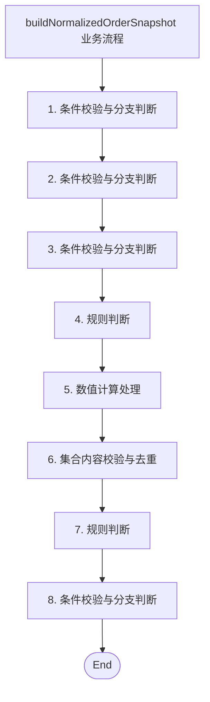
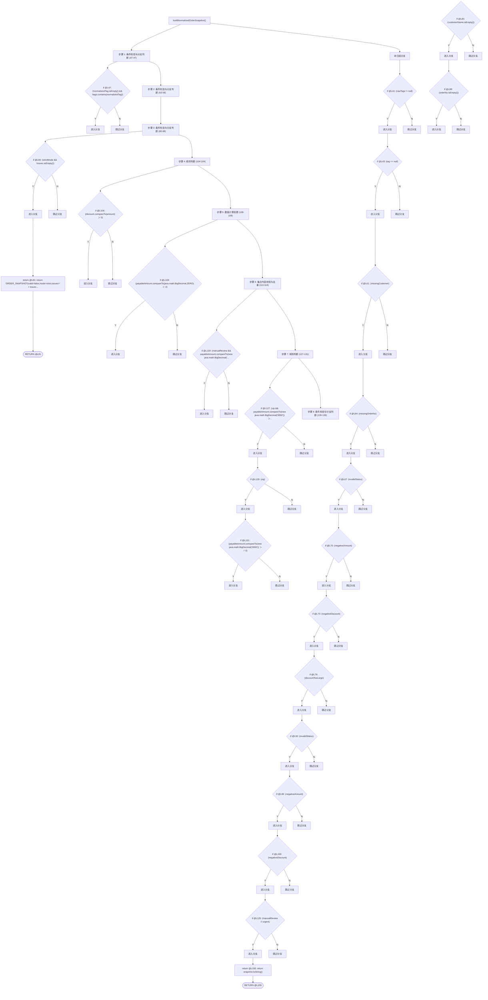

# 方法执行路径说明：buildNormalizedOrderSnapshot

## 1. 基本信息

- 类名：`OrderUtils`
- 文件：`src/main/java/com/example/ordersystem/util/OrderUtils.java`
- 方法签名：

```java
public static String buildNormalizedOrderSnapshot(
            String rawCustomerName,
            String rawOrderNo,
            String rawStatus,
            java.math.BigDecimal rawAmount,
            java.math.BigDecimal discountAmount,
            java.util.List<String> rawTags,
            boolean strictMode
    )
```

## 2. 最终执行总结

方法 buildNormalizedOrderSnapshot 的主流程可以概括为：先处理“条件校验与分支判断”，产出是否继续后续流程的判断结论，必要时触发提前返回或分支切换；接着处理“条件校验与分支判断”，产出是否继续后续流程的判断结论，必要时触发提前返回或分支切换；接着处理“条件校验与分支判断”，产出是否继续后续流程的判断结论，必要时触发提前返回或分支切换；接着处理“规则判断”，产出是否继续后续流程的判断结论，必要时触发提前返回或分支切换；接着处理“数值计算处理”，得到新的金额结果、阈值判断结论或修正后的数值状态；接着处理“集合内容校验与去重”，更新后的问题项集合，用于后续风险判断、兜底处理或最终输出；接着处理“规则判断”，产出是否继续后续流程的判断结论，必要时触发提前返回或分支切换；最后处理“条件校验与分支判断”，产出是否继续后续流程的判断结论，必要时触发提前返回或分支切换。

## 3. 主流程业务步骤

### 步骤 1：条件校验与分支判断

- 代码行范围：`47 - 47`
- 步骤总结：该步骤检查输入或当前候选值是否有效，并决定是提前返回、跳过当前项，还是继续进入后续处理。
- 步骤输入：当前方法参数、已生成的中间变量，以及用于判断是否继续执行的条件状态。
- 步骤输出：产出是否继续后续流程的判断结论，必要时触发提前返回或分支切换。

### 步骤 2：条件校验与分支判断

- 代码行范围：`53 - 58`
- 步骤总结：该步骤检查输入或当前候选值是否有效，并决定是提前返回、跳过当前项，还是继续进入后续处理。
- 步骤输入：当前方法参数、已生成的中间变量，以及用于判断是否继续执行的条件状态。
- 步骤输出：产出是否继续后续流程的判断结论，必要时触发提前返回或分支切换。

### 步骤 3：条件校验与分支判断

- 代码行范围：`80 - 88`
- 步骤总结：该步骤检查输入或当前候选值是否有效，并决定是提前返回、跳过当前项，还是继续进入后续处理。
- 步骤输入：当前方法参数、已生成的中间变量，以及用于判断是否继续执行的条件状态。
- 步骤输出：产出是否继续后续流程的判断结论，必要时触发提前返回或分支切换。

### 步骤 4：规则判断

- 代码行范围：`104 - 104`
- 步骤总结：该步骤主要围绕 compareTo 等调用展开，集中处理 规则判断，代码范围约在第 104 到 104 行。
- 步骤输入：当前方法参数、已生成的中间变量，以及用于判断是否继续执行的条件状态。
- 步骤输出：产出是否继续后续流程的判断结论，必要时触发提前返回或分支切换。

### 步骤 5：数值计算处理

- 代码行范围：`108 - 109`
- 步骤总结：该步骤主要围绕 compareTo、subtract 等调用展开，集中处理 数值计算处理，代码范围约在第 108 到 109 行。
- 步骤输入：金额、折扣、阈值等数值型中间状态，以及前置判断结果。
- 步骤输出：得到新的金额结果、阈值判断结论或修正后的数值状态。

### 步骤 6：集合内容校验与去重

- 代码行范围：`113 - 118`
- 步骤总结：该步骤主要围绕 compareTo、contains、isEmpty 等调用展开，集中处理 集合内容校验与去重，代码范围约在第 113 到 118 行。
- 步骤输入：前面校验阶段得到的异常标记、缺失字段信息或非法状态判断结果。
- 步骤输出：更新后的问题项集合，用于后续风险判断、兜底处理或最终输出。

### 步骤 7：规则判断

- 代码行范围：`127 - 131`
- 步骤总结：该步骤主要围绕 compareTo 等调用展开，集中处理 规则判断，代码范围约在第 127 到 131 行。
- 步骤输入：当前方法参数、已生成的中间变量，以及用于判断是否继续执行的条件状态。
- 步骤输出：产出是否继续后续流程的判断结论，必要时触发提前返回或分支切换。

### 步骤 8：条件校验与分支判断

- 代码行范围：`139 - 139`
- 步骤总结：该步骤检查输入或当前候选值是否有效，并决定是提前返回、跳过当前项，还是继续进入后续处理。
- 步骤输入：当前方法参数、已生成的中间变量，以及用于判断是否继续执行的条件状态。
- 步骤输出：产出是否继续后续流程的判断结论，必要时触发提前返回或分支切换。

## 4. 标准输入模拟

### 标准输入

- `rawCustomerName` (String): `Alice`
- `rawOrderNo` (String): `ORD-20260417-001`
- `rawStatus` (String): `paid`
- `rawAmount` (BigDecimal): `12000`
- `discountAmount` (BigDecimal): `1000`
- `rawTags` (List<String>): `[vip, urgent]`
- `strictMode` (boolean): `false`

### 预期执行摘要

- 步骤 1：条件校验与分支判断 → 产出是否继续后续流程的判断结论，必要时触发提前返回或分支切换。
- 步骤 2：条件校验与分支判断 → 产出是否继续后续流程的判断结论，必要时触发提前返回或分支切换。
- 步骤 3：条件校验与分支判断 → 产出是否继续后续流程的判断结论，必要时触发提前返回或分支切换。
- 步骤 4：规则判断 → 产出是否继续后续流程的判断结论，必要时触发提前返回或分支切换。
- 步骤 5：数值计算处理 → 得到新的金额结果、阈值判断结论或修正后的数值状态。
- 步骤 6：集合内容校验与去重 → 更新后的问题项集合，用于后续风险判断、兜底处理或最终输出。
- 步骤 7：规则判断 → 产出是否继续后续流程的判断结论，必要时触发提前返回或分支切换。
- 步骤 8：条件校验与分支判断 → 产出是否继续后续流程的判断结论，必要时触发提前返回或分支切换。

### 预期输出

- `按当前源码推断，该方法存在多条返回路径：提前结束时可能返回当前分支拼装出的固定格式字符串；主路径最终返回组装完成的字符串结果。`

## 5. 调试附录

### 业务流程 Mermaid 图



### 分支执行 Mermaid 图



### 主流程调用明细

- [1] `normalizedTag.isEmpty()` | type=`library_value_method` | line=`47`
- [2] `tags.contains(normalizedTag)` | type=`library_value_method` | line=`47`
- [3] `customerName.isEmpty()` | type=`library_value_method` | line=`53`
- [4] `orderNo.isEmpty()` | type=`library_value_method` | line=`54`
- [5] `"CREATED".equals(status)` | type=`library_value_method` | line=`55`
- [6] `"PAID".equals(status)` | type=`library_value_method` | line=`55`
- [7] `"CANCELLED".equals(status)` | type=`library_value_method` | line=`55`
- [8] `amount.compareTo(java.math.BigDecimal.ZERO)` | type=`library_value_method` | line=`56`
- [9] `discount.compareTo(java.math.BigDecimal.ZERO)` | type=`library_value_method` | line=`57`
- [10] `discount.compareTo(amount)` | type=`library_value_method` | line=`58`
- [11] `issues.isEmpty()` | type=`library_value_method` | line=`80`
- [12] `customerName.isEmpty()` | type=`library_value_method` | line=`84`
- [13] `orderNo.isEmpty()` | type=`library_value_method` | line=`88`
- [14] `discount.compareTo(amount)` | type=`library_value_method` | line=`104`
- [15] `amount.subtract(discount)` | type=`library_value_method` | line=`108`
- [16] `payableAmount.compareTo(java.math.BigDecimal.ZERO)` | type=`library_value_method` | line=`109`
- [17] `tags.contains("vip")` | type=`library_value_method` | line=`113`
- [18] `tags.contains("urgent")` | type=`library_value_method` | line=`114`
- [19] `tags.contains("manual-review")` | type=`library_value_method` | line=`115`
- [20] `issues.isEmpty()` | type=`library_value_method` | line=`115`
- [21] `payableAmount.compareTo(new java.math.BigDecimal("10000"))` | type=`library_value_method` | line=`118`
- [22] `payableAmount.compareTo(new java.math.BigDecimal("5000"))` | type=`library_value_method` | line=`127`
- [23] `payableAmount.compareTo(new java.math.BigDecimal("3000"))` | type=`library_value_method` | line=`131`
- [24] `issues.isEmpty()` | type=`library_value_method` | line=`139`

### 分支信息

- [1] `if` | line=`41` | (rawTags != null)
- [2] `if` | line=`43` | (tag == null)
- [3] `if` | line=`47` | (!normalizedTag.isEmpty() && !tags.contains(normalizedTag))
- [4] `if` | line=`61` | (missingCustomer)
- [5] `if` | line=`64` | (missingOrderNo)
- [6] `if` | line=`67` | (invalidStatus)
- [7] `if` | line=`70` | (negativeAmount)
- [8] `if` | line=`73` | (negativeDiscount)
- [9] `if` | line=`76` | (discountTooLarge)
- [10] `if` | line=`80` | (strictMode && !issues.isEmpty())
- [11] `return` | line=`81` | return "ORDER_SNAPSHOT{valid=false,mode=strict,issues=" + issues + "}";
- [12] `if` | line=`84` | (customerName.isEmpty())
- [13] `if` | line=`88` | (orderNo.isEmpty())
- [14] `if` | line=`92` | (invalidStatus)
- [15] `if` | line=`96` | (negativeAmount)
- [16] `if` | line=`100` | (negativeDiscount)
- [17] `if` | line=`104` | (discount.compareTo(amount) > 0)
- [18] `if` | line=`109` | (payableAmount.compareTo(java.math.BigDecimal.ZERO) < 0)
- [19] `if` | line=`118` | (manualReview && payableAmount.compareTo(new java.math.BigDecimal("10000")) > 0)
- [20] `if` | line=`120` | (manualReview || urgent)
- [21] `if` | line=`127` | (vip && payableAmount.compareTo(new java.math.BigDecimal("5000")) >= 0)
- [22] `if` | line=`129` | (vip)
- [23] `if` | line=`131` | (payableAmount.compareTo(new java.math.BigDecimal("3000")) >= 0)
- [24] `return` | line=`155` | return snapshot.toString();

### 方法源码

```java
public static String buildNormalizedOrderSnapshot(
            String rawCustomerName,
            String rawOrderNo,
            String rawStatus,
            java.math.BigDecimal rawAmount,
            java.math.BigDecimal discountAmount,
            java.util.List<String> rawTags,
            boolean strictMode
    ) {
        String customerName = rawCustomerName == null ? "" : rawCustomerName.trim();
        String orderNo = rawOrderNo == null ? "" : rawOrderNo.trim();
        String status = rawStatus == null ? "" : rawStatus.trim().toUpperCase();

        java.math.BigDecimal amount = rawAmount == null ? java.math.BigDecimal.ZERO : rawAmount;
        java.math.BigDecimal discount = discountAmount == null ? java.math.BigDecimal.ZERO : discountAmount;

        java.util.List<String> tags = new java.util.ArrayList<>();
        if (rawTags != null) {
            for (String tag : rawTags) {
                if (tag == null) {
                    continue;
                }
                String normalizedTag = tag.trim().toLowerCase();
                if (!normalizedTag.isEmpty() && !tags.contains(normalizedTag)) {
                    tags.add(normalizedTag);
                }
            }
        }

        boolean missingCustomer = customerName.isEmpty();
        boolean missingOrderNo = orderNo.isEmpty();
        boolean invalidStatus = !("CREATED".equals(status) || "PAID".equals(status) || "CANCELLED".equals(status));
        boolean negativeAmount = amount.compareTo(java.math.BigDecimal.ZERO) < 0;
        boolean negativeDiscount = discount.compareTo(java.math.BigDecimal.ZERO) < 0;
        boolean discountTooLarge = discount.compareTo(amount) > 0;

        java.util.List<String> issues = new java.util.ArrayList<>();
        if (missingCustomer) {
            issues.add("missing_customer");
        }
        if (missingOrderNo) {
            issues.add("missing_order_no");
        }
        if (invalidStatus) {
            issues.add("invalid_status");
        }
        if (negativeAmount) {
            issues.add("negative_amount");
        }
        if (negativeDiscount) {
            issues.add("negative_discount");
        }
        if (discountTooLarge) {
            issues.add("discount_too_large");
        }

        if (strictMode && !issues.isEmpty()) {
            return "ORDER_SNAPSHOT{valid=false,mode=strict,issues=" + issues + "}";
        }

        if (customerName.isEmpty()) {
            customerName = "UNKNOWN_CUSTOMER";
        }

        if (orderNo.isEmpty()) {
            orderNo = "NO_ORDER_NO";
        }

        if (invalidStatus) {
            status = "CREATED";
        }

        if (negativeAmount) {
            amount = java.math.BigDecimal.ZERO;
        }

        if (negativeDiscount) {
            discount = java.math.BigDecimal.ZERO;
        }

        if (discount.compareTo(amount) > 0) {
            discount = amount;
        }

        java.math.BigDecimal payableAmount = amount.subtract(discount);
        if (payableAmount.compareTo(java.math.BigDecimal.ZERO) < 0) {
            payableAmount = java.math.BigDecimal.ZERO;
        }

        boolean vip = tags.contains("vip");
        boolean urgent = tags.contains("urgent");
        boolean manualReview = tags.contains("manual-review") || !issues.isEmpty();

        String riskLevel;
        if (manualReview && payableAmount.compareTo(new java.math.BigDecimal("10000")) > 0) {
            riskLevel = "HIGH";
        } else if (manualReview || urgent) {
            riskLevel = "MEDIUM";
        } else {
            riskLevel = "LOW";
        }

        String customerSegment;
        if (vip && payableAmount.compareTo(new java.math.BigDecimal("5000")) >= 0) {
            customerSegment = "VIP_HIGH_VALUE";
        } else if (vip) {
            customerSegment = "VIP";
        } else if (payableAmount.compareTo(new java.math.BigDecimal("3000")) >= 0) {
            customerSegment = "HIGH_VALUE";
        } else {
            customerSegment = "NORMAL";
        }

        StringBuilder snapshot = new StringBuilder();
        snapshot.append("ORDER_SNAPSHOT{");
        snapshot.append("valid=").append(issues.isEmpty());
        snapshot.append(",customer=").append(customerName);
        snapshot.append(",orderNo=").append(orderNo);
        snapshot.append(",status=").append(status);
        snapshot.append(",amount=").append(amount);
        snapshot.append(",discount=").append(discount);
        snapshot.append(",payable=").append(payableAmount);
        snapshot.append(",segment=").append(customerSegment);
        snapshot.append(",risk=").append(riskLevel);
        snapshot.append(",vip=").append(vip);
        snapshot.append(",urgent=").append(urgent);
        snapshot.append(",manualReview=").append(manualReview);
        snapshot.append(",tags=").append(tags);
        snapshot.append(",issues=").append(issues);
        snapshot.append("}");

        return snapshot.toString();
    }
```
